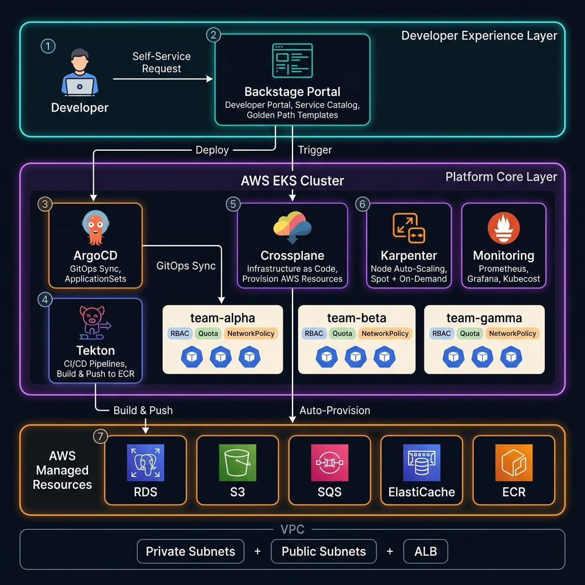

<div align="center">



# Internal Developer Platform

[](https://kubernetes.io)
[](https://terraform.io)
[](https://aws.amazon.com/eks/)
[](https://crossplane.io)
[](https://backstage.io)

Self-service platform on **AWS EKS** where developers provision services, databases, and environments — **no DevOps bottleneck.**

</div>

---

## 📑 Table of Contents

- [The Problem](#-the-problem)
- [The Solution](#-the-solution)
- [Architecture](#-architecture)
- [Technology Stack](#-technology-stack)
- [Project Structure](#-project-structure)
- [Roadmap](#-roadmap)

---

## ❌ The Problem

In a typical DevOps setup, every time a developer needs something new:

```
Developer: "I need a new service with a PostgreSQL database"
    → Opens a ticket
    → Waits for the DevOps engineer
    → DevOps creates: Namespace, Deployment, Service, HPA, Ingress, Secrets,
                       Database, CI/CD pipeline, Monitoring dashboard...
    → Days or weeks later: service is ready
```

**The DevOps engineer is the bottleneck.** Nothing moves without them.

---

## ✅ The Solution

Build a **self-service platform** where developers help themselves:

```
Developer opens Backstage Portal
    → Picks a template (Node.js / Python / React)
    → Fills out a form: service name, team, needs database?
    → Clicks "Create"
    → Within minutes:
        ✅ Git repo scaffolded with production-ready boilerplate
        ✅ CI/CD pipeline configured and ready
        ✅ Database provisioned on AWS (via Crossplane)
        ✅ Kubernetes namespace with RBAC, quotas, network policies
        ✅ Application deployed and accessible
        ✅ Monitoring dashboard live
    → Zero manual intervention.
```

---

## 🏗️ Architecture

The platform has **three layers**:

| Layer | Components | Purpose |
|:--|:--|:--|
| **Developer Experience** | Backstage Portal, Golden Path Templates | Self-service UI + ready-to-use templates |
| **Platform Core** | ArgoCD, Tekton, Crossplane, Karpenter, Gatekeeper | GitOps, CI/CD, infra provisioning, scaling, policies |
| **AWS Resources** | RDS, S3, SQS, ElastiCache, ECR | Managed services provisioned automatically by Crossplane |

### How It Works

```
                    Backstage Portal
                         │
              ┌──────────┼──────────┐
              ▼          ▼          ▼
           ArgoCD    Crossplane   Tekton
          (deploy)  (provision)  (build)
              │          │          │
              ▼          ▼          ▼
        ┌─────────┐  ┌──────┐  ┌─────┐
        │ Team NS │  │ RDS  │  │ ECR │
        │ (pods)  │  │ S3   │  │     │
        └─────────┘  │ SQS  │  └─────┘
                     └──────┘
```

---

## 🛠️ Technology Stack

| Layer | Technology | Purpose |
|:--|:--|:--|
| **Infrastructure** | Terraform | EKS Cluster + VPC + Networking |
| **Cluster** | AWS EKS (K8s 1.30) | Container orchestration |
| **Node Scaling** | Karpenter | Fast node provisioning (Spot + On-Demand) |
| **GitOps** | ArgoCD + ApplicationSets | Multi-tenant continuous delivery |
| **CI/CD** | Tekton Pipelines | Build, scan, push — natively in K8s |
| **Infra Provisioning** | Crossplane | AWS resources as Kubernetes CRDs |
| **Developer Portal** | Backstage | Service catalog + self-service UI |
| **Templates** | Backstage Software Templates | Golden path scaffolding |
| **Multi-Tenancy** | Namespaces + RBAC + Quotas | Team isolation and resource control |
| **Policy** | OPA Gatekeeper | Enforce security and best practices |
| **Secrets Encryption** | AWS KMS | K8s Secrets encrypted at rest |
| **Pod Isolation** | VPC CNI + IRSA | Per-pod IAM roles + native NetworkPolicies |
| **Node Access** | SSM (no SSH) | Secure node debugging without open ports |
| **Monitoring** | Prometheus + Grafana | Metrics and dashboards |
| **Cost** | Kubecost | Per-team cost tracking |
| **TLS** | cert-manager + Let's Encrypt | Automatic HTTPS |

---

## 📂 Project Structure

```
.
├── infrastructure/
│   ├── terraform/
│   │   ├── modules/
│   │   │   ├── network/
│   │   │   │   ├── vpc.tf              # VPC, Subnets, IGW, Route Tables
│   │   │   │   ├── security.tf         # Security Groups (EKS Nodes, VPC Endpoints)
│   │   │   │   ├── endpoints.tf        # VPC Endpoints (S3, ECR, STS, EKS)
│   │   │   │   ├── variables.tf
│   │   │   │   └── outputs.tf
│   │   │   └── eks/
│   │   │       ├── cluster.tf          # EKS Cluster + KMS Encryption + Node Group
│   │   │       ├── iam.tf              # IAM Roles + OIDC Provider (IRSA)
│   │   │       ├── karpenter.tf        # Karpenter IRSA + Helm Release
│   │   │       ├── addons.tf           # EBS CSI, CoreDNS, VPC CNI, Metrics Server
│   │   │       ├── variables.tf
│   │   │       └── outputs.tf
│   │   └── environments/
│   │       └── prod/
│   │           ├── network/            # Prod VPC config
│   │           ├── eks/                # Prod EKS config
│   │           └── storage/            # S3 (Terraform remote state)
│   └── crossplane/
│       ├── providers/                  # AWS Provider + credentials
│       ├── compositions/               # Reusable infra templates (RDS, S3, Redis, SQS)
│       └── claims/                     # Example developer requests
├── platform/
│   ├── argocd/
│   │   ├── install/                    # ArgoCD Helm values
│   │   ├── applicationsets/            # Auto-generate apps per team
│   │   └── projects/                   # ArgoCD project per team
│   ├── tekton/
│   │   ├── pipelines/                  # Build → Scan → Push → Deploy
│   │   ├── tasks/                      # Reusable build tasks
│   │   └── triggers/                   # GitHub webhook triggers
│   ├── monitoring/
│   │   ├── prometheus/                 # Prometheus Helm values
│   │   ├── grafana/                    # Dashboards
│   │   └── kubecost/                   # Cost tracking
│   ├── security/
│   │   ├── gatekeeper/                 # OPA constraint templates
│   │   └── cert-manager/               # TLS certificates
│   └── backstage/
│       ├── app-config.yaml             # Backstage config
│       ├── catalog/                    # Service catalog
│       ├── templates/                  # Software templates (golden paths)
│       └── Dockerfile
├── tenants/
│   ├── base/                           # Base tenant config (Kustomize)
│   │   ├── namespace.yaml
│   │   ├── rbac.yaml
│   │   ├── resource-quota.yaml
│   │   ├── limit-range.yaml
│   │   └── network-policy.yaml
│   ├── team-alpha/                     # Team Alpha overlay
│   ├── team-beta/                      # Team Beta overlay
│   └── team-gamma/                     # Team Gamma overlay
├── golden-paths/
│   ├── nodejs-service/                 # Node.js template
│   │   ├── skeleton/                   # App code + Dockerfile + K8s manifests
│   │   └── template.yaml              # Backstage template definition
│   ├── python-fastapi/                 # Python FastAPI template
│   └── react-frontend/                # React template
├── docs/
│   └── images/
├── Makefile
└── README.md
```

---

## 🗺️ Roadmap

### Phase 1 — Base Infrastructure ✅
> EKS cluster with Terraform, Karpenter, and core networking.

- [x] VPC + Subnets + Security Groups (Terraform module)
- [x] VPC Endpoints (S3, ECR, STS, EKS — no NAT Gateway needed)
- [x] EKS Cluster + On-Demand Node Group
- [x] KMS Encryption for K8s Secrets at rest
- [x] IRSA (OIDC + VPC CNI per-pod IAM roles)
- [x] Native NetworkPolicy support (VPC CNI)
- [x] Karpenter for node auto-scaling
- [x] EKS Managed Addons (EBS CSI, CoreDNS, VPC CNI, kube-proxy)
- [x] Metrics Server
- [ ] Makefile (`make infra-up`, `make infra-down`)

### Phase 2 — Multi-Tenancy
> Isolated namespaces per team with RBAC, quotas, and network policies.

- [ ] Base tenant config with Kustomize
- [ ] RBAC: team members access their namespace only
- [ ] ResourceQuotas and LimitRanges per team
- [ ] NetworkPolicies: default-deny + allow within namespace
- [ ] Onboard 3 teams (alpha, beta, gamma)

### Phase 3 — Crossplane (Infrastructure as Code)
> Developers provision AWS resources by writing Kubernetes CRDs.

- [ ] Install Crossplane + AWS Provider
- [ ] PostgreSQL Composition (RDS + SecurityGroup + SubnetGroup)
- [ ] S3 Bucket Composition
- [ ] Redis Composition (ElastiCache)
- [ ] Example Claims for developer self-service

### Phase 4 — GitOps & CI/CD
> ArgoCD for deployments, Tekton for builds — all automated.

- [ ] ArgoCD install + multi-tenant projects
- [ ] ApplicationSets: auto-create apps from Git directories
- [ ] Tekton Pipelines: git-clone → build → scan → push to ECR
- [ ] Tekton Triggers: GitHub webhook → auto-build

### Phase 5 — Golden Paths & Security
> Production-ready templates + policy enforcement.

- [ ] Node.js service template (code + Dockerfile + K8s + CI/CD)
- [ ] Python FastAPI template
- [ ] React frontend template
- [ ] OPA Gatekeeper: require labels, enforce limits, block NodePort

### Phase 6 — Developer Portal (Backstage)
> Web UI for self-service: create services, view catalog, manage infra.

- [ ] Backstage setup + configuration
- [ ] Service catalog integration
- [ ] Register golden path templates
- [ ] Kubernetes plugin (view pods, deployments)

### Phase 7 — Monitoring, Cost & Documentation
> Observability, cost tracking, and project documentation.

- [ ] Prometheus + Grafana dashboards
- [ ] Kubecost for per-team cost visibility
- [ ] Architecture diagram + onboarding docs
- [ ] Full README with deploy instructions

---

<p align="center">
  Built with ❤️ by <a href="https://github.com/amr-elzoghby">Amr Elzoghby</a>
</p>
