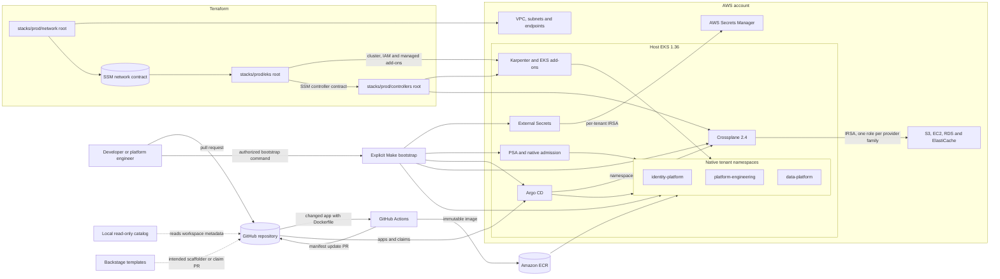

<div align="center">


# Internal Developer Platform

[](https://kubernetes.io/)
[](https://www.crossplane.io/)
[](https://developer.hashicorp.com/terraform)
[](https://aws.amazon.com/eks/)
[](#validation-evidence)

An AWS EKS platform reference implementation built around reviewed Git changes, namespace-scoped tenancy, GitOps delivery, and namespaced Crossplane APIs.

</div>

> [!IMPORTANT]
> This repository has passed local and static validation, but the current revision has not been deployed end to end to a live AWS/EKS environment. “Configured” below means the implementation exists in Git; it does not mean a controller or cloud resource is currently running.

## What this repository contains

- Three Terraform deployment roots for network, EKS/AWS integrations, and controller releases, plus an independent remote-state bootstrap root.
- Three native EKS tenant namespaces with EKS access entries, Kubernetes RBAC, quotas, limits, Pod Security Admission, and NetworkPolicies.
- Argo CD AppProjects and ApplicationSets scoped to each approved team.
- Four direct, namespaced Crossplane v2 APIs for S3, EC2, RDS PostgreSQL, and ElastiCache Redis.
- GitHub Actions that validate changes, build and scan monorepo services, publish signed ECR digests, and open manifest-update pull requests.
- Backstage template definitions plus a lightweight, local, read-only catalog.

It does **not** currently provide a fully built Backstage application, a verified live cluster, or a configured external Ingress path. Service templates now submit pull requests to this monorepo; their complete build-to-deployment flow is being validated.

## Current component status

| Area | Repository state | Live evidence |
|---|---|---|
| Terraform network | Implemented; `validate` passes | Not applied in this review |
| Terraform EKS | Implemented; `validate` passes with dependency deprecation warnings | Not applied in this review |
| Tenant RBAC and admission | Manifests implemented and parsed | No EKS API-server tests yet |
| Argo CD | Chart and boundaries configured | No sync test yet |
| Crossplane | Core, providers, XRDs, Compositions, and claims configured | No provider reconciliation test yet |
| GitHub Actions | Workflow implemented for `apps/<team>/<service>` | No workflow run verified for this revision |
| Local catalog | Read-only server and UI; local HTTP smoke passed | Local only |
| Backstage | Development configuration example, catalog entities, and templates only | No runnable Backstage application |
| Monitoring | Values/dashboard files exist; separate Make target | No live Prometheus/Grafana/Kubecost evidence |
| Kyverno | Legacy policy files retained | Bootstrap intentionally disables it |

## Architecture

The generated image above is a high-level visual. This diagram is the source of truth for the relationships implemented in the repository:


```mermaid
flowchart LR
    DEV[Developer or platform engineer]
    GIT[(GitHub repository)]
    LOCAL[Local read-only catalog]
    TPL[Backstage templates]
    BOOT[Explicit Make bootstrap]
    CI[GitHub Actions]
    ECR[(Amazon ECR)]

    subgraph TF[Terraform]
        NETROOT[stacks/prod/network root]
        EKSROOT[stacks/prod/eks root]
        NETCONTRACT[(SSM network contract)]
        CTLROOT[stacks/prod/controllers root]
    end

    subgraph AWS[AWS account]
        VPC[VPC, subnets and endpoints]

        subgraph HOST[Host EKS 1.36]
            ARGO[Argo CD]
            CP[Crossplane 2.4]
            ESO[External Secrets]
            POLICY[PSA and native admission]
            KARP[Karpenter and EKS add-ons]

            subgraph TENANTS[Native tenant namespaces]
                ID[identity-platform]
                PE[platform-engineering]
                DATA[data-platform]
            end

        end

        CLOUD[S3, EC2, RDS and ElastiCache]
        SM[AWS Secrets Manager]
    end

    DEV -->|pull request| GIT
    LOCAL -. reads workspace metadata .-> GIT
    TPL -. intended scaffolder or claim PR .-> GIT
    DEV -->|authorized bootstrap command| BOOT
    GIT -->|changed app with Dockerfile| CI
    CI -->|immutable image| ECR
    CI -->|manifest update PR| GIT
    GIT -->|apps and claims| ARGO
    ARGO --> TENANTS
    ARGO -->|namespaced IDP claims| CP
    CP -->|IRSA, one role per provider family| CLOUD
    ESO -->|per-tenant IRSA| SM

    NETROOT --> VPC
    NETROOT --> NETCONTRACT
    NETCONTRACT --> EKSROOT
    EKSROOT -->|cluster, IAM and managed add-ons| KARP
    EKSROOT -->|SSM controller contract| CTLROOT
    CTLROOT --> KARP
    CTLROOT --> CP
    BOOT --> ESO
    BOOT --> POLICY
    BOOT --> ARGO
    BOOT --> CP
    BOOT --> TENANTS
    ECR --> TENANTS
    POLICY --> TENANTS
    KARP --> TENANTS
```

### Terraform dependency flow

```text
infrastructure/terraform/stacks/prod/network
  └─ module.network
     ├─ VPC 10.0.0.0/16
     ├─ public, private workload, and isolated data subnets in two AZs
     ├─ route tables and Internet Gateway
     ├─ node and endpoint Security Groups
     └─ S3, ECR, STS, EKS, EC2, SSM and Logs endpoints

network outputs
  └─ explicit nonsecret SSM network contract
     └─ read by stacks/prod/eks
        └─ module.eks
           ├─ EKS 1.36 and encrypted Kubernetes Secrets
           ├─ stable managed node group
           ├─ EKS managed add-ons and encrypted worker volumes
           ├─ EKS access entries and tenant IRSA roles
           ├─ GitHub Actions OIDC/ECR permissions
           └─ nonsecret SSM controller contract
              └─ stacks/prod/controllers
                 └─ Karpenter, Crossplane, Metrics Server and AWS LBC releases
```

The roots deliberately use separate state keys:

- `prod/network/terraform.tfstate`
- `prod/eks/terraform.tfstate`
- `prod/controllers/terraform.tfstate`

`stacks/bootstrap/state` independently provisions the versioned, private state bucket, KMS encryption, and state-operator permissions. Deployment roots use native S3 lock files. Keep the bootstrap root's initial local state in restricted encrypted storage; the state backend must exist before planning deployment roots. Consumers read explicit nonsecret SSM contracts instead of another stack's full state snapshot.

Changing an existing installation to these state boundaries requires a reviewed state migration. Do not apply a fresh layout over existing controller releases or recreate an existing state bucket. The saved-plan wrapper verifies backend identity, account, source digest, and exact plan approval before apply. See the [HashiCorp S3 backend reference](https://developer.hashicorp.com/terraform/language/backend/s3) for lock-file and KMS permissions.

## Tenant model

| Team | Native namespace | EKS groups | Argo CD project |
|---|---|---|---|
| Identity Platform | `identity-platform` | `idp:tenant:identity-platform:viewer`<br>`idp:tenant:identity-platform:operator` | `identity-platform` |
| Platform Engineering | `platform-engineering` | `idp:tenant:platform-engineering:viewer`<br>`idp:tenant:platform-engineering:operator` | `platform-engineering` |
| Data Platform | `data-platform` | `idp:tenant:data-platform:viewer`<br>`idp:tenant:data-platform:operator` | `data-platform` |

Native namespaces are the only tenant isolation model implemented by this repository. A viewer can inspect ordinary workload resources and logs inside its own namespace. An operator adds limited pod deletion and scale operations. Neither role is granted Secret access or RBAC mutation.

The access path is `IAM role -> EKS access entry -> Kubernetes group -> one or more namespaced RoleBindings`. Viewer groups bind to `idp-tenant-viewer`; operator groups bind to both `idp-tenant-viewer` and `idp-tenant-operator-actions`. The example variables use AWS IAM Identity Center roles, so a tenant user can authenticate with a matching local AWS CLI profile and verify both the intended access and the isolation boundary:

```bash
aws sso login --profile identity-platform-viewer
aws eks update-kubeconfig \
  --name idp-prod \
  --region us-east-1 \
  --profile identity-platform-viewer \
  --alias idp-prod-identity-platform-viewer

kubectl auth can-i get pods -n identity-platform       # expected: yes
kubectl auth can-i get secrets -n identity-platform    # expected: no
kubectl auth can-i get pods -n data-platform           # expected: no
```

Namespace-only tenancy keeps one control plane, one bootstrap path, and lower operating cost. The trade-off is a shared control-plane blast radius: tenants cannot choose an independent Kubernetes version or API server, and cluster-scoped CRDs or controllers remain platform-owned rather than tenant-owned.

Each namespace receives:

- `ResourceQuota` and `LimitRange`.
- a restricted workload ServiceAccount with token automount disabled by default.
- a per-tenant External Secrets IRSA identity.
- Pod Security labels: restricted enforced, audited, and warned.
- native admission rules for tenant-owned ECR SHA-256 image digests, CPU/memory requests and limits, and a team label matching the namespace.
- tenant NetworkPolicies for same-namespace traffic, DNS, public HTTPS, and explicitly labelled PostgreSQL/Redis clients targeting isolated data subnets.

Database ingress uses the EKS node Security Group; per-workload access is enforced by tenant NetworkPolicies. Their CIDRs are rendered from reviewed Terraform outputs. Private ingress remains disabled until a real hostname, certificate, and approved load-balancer path are configured.

## GitOps and application delivery

Argo CD watches:

- `apps/identity-platform/*`
- `apps/platform-engineering/*`
- `apps/data-platform/*`
- `infrastructure/crossplane/claims/*`

Team AppProjects can deploy only to their own namespace and only approved namespaced workload kinds. The default project is closed. The infrastructure project accepts only the four `idp.io` claim kinds and External Secrets resources in approved tenant namespaces.

For a service already inside `apps/<team>/<service>` with a `Dockerfile`:

```text
merge app change to main
→ GitHub Actions detects the service
→ build and smoke-test the source image without AWS credentials
→ fail on HIGH or CRITICAL Trivy findings
→ assume a scoped publishing role with GitHub OIDC in a separate job
→ push to a Terraform-owned immutable ECR repository and sign its digest
→ open a dedicated manifest-update pull request
→ review and merge
→ Argo CD reconciles the manifest
```

The current `login-app` is explicitly quarantined: its source is absent and its Kustomization activates no workloads. Its external artifact cannot be promoted until ownership, provenance, runtime behavior, and a verified digest are supplied. Manifest changes pass release verification, including Kustomize restrictions that prevent overriding the checked image after verification.

## Crossplane infrastructure APIs

Crossplane uses direct namespaced v2 XRDs. A claim and its generated managed resources stay in the requesting namespace.

| API | AWS resources generated | Current safety defaults |
|---|---|---|
| `ObjectBucket` | Bucket plus six configuration resources | public access blocked, ownership enforced, versioning, encryption, TLS-only access, safe retention |
| `ServerInstance` | EC2 Instance, Security Group, rule | approved SSM utility image, private IP, no ingress, IMDSv2, encrypted gp3 root, scoped instance profile |
| `PostgresSQLInstance` | RDS Instance, subnet group, Security Group, rule | isolated data subnets, node-SG ingress, Multi-AZ, encryption, backups, final snapshot, monitoring and log exports |
| `RedisInstance` | ElastiCache Replication Group, subnet group, Security Group, rule | isolated data subnets, node-SG ingress, required TLS, auth, encryption, two-node failover and snapshots |

The package layer is intentionally limited:

- Crossplane Core `2.4.0`
- Upbound AWS providers `2.7.0` for S3, EC2, RDS, and ElastiCache
- Crossplane Function Python `0.5.0`
- one `ClusterProviderConfig`
- four dedicated IRSA roles
- one ManagedResourceActivationPolicy activating exactly fourteen managed resource kinds

Managed resources omit the `Delete` management policy. Removing a Git claim therefore does not automatically delete the cloud resource. This protects stateful resources from accidental Git pruning, but requires an explicit orphan cleanup and deletion runbook.

The approved database template writes a PostgreSQL claim and ExternalSecret into the monorepo claims path through a pull request. Redis, S3, and EC2 have APIs but no reviewed Backstage request template yet.

## Developer experience

### Local catalog

`make portal-up` launches `platform/developer-portal/local-catalog/server.js` on `127.0.0.1:3000`.

It can:

- scan local `catalog-info.yaml` files;
- show detected infrastructure YAML files;
- display the four implemented API contracts;
- present a local team view selector.

It cannot authenticate users, enforce RBAC, write files, run Git commands, provision infrastructure, or report live Kubernetes/Argo/Trivy/SonarQube metrics. The team selector is presentation-only.

### Backstage assets

`platform/developer-portal/backstage-config` contains an explicitly named development configuration example. The incomplete Dockerfile has been removed. Running the scaffolder requires a separately maintained Backstage application with authentication and the referenced integrations. TechDocs annotations are omitted until a real build and publication path exists.

The Node.js and Python templates open reviewed pull requests into `apps/<team>/<service>` in this repository. Both emit root deployment manifests and a Kustomize entry point that Argo CD can discover. New services start with an empty resource list until a built image digest is promoted. The form does not request a prebuilt image; descriptions are serialized for their target formats and identifiers have shared length and character constraints. Delivery runs are no longer canceled when another service changes.

Infrastructure requests declare an owner and an ownership review date, retain those values in AWS tags, and use enforced Composition references with Manual revision updates. Retained-resource decommission requires inventory, a tested recovery copy, and explicit owner approval. Promote revisions only after a sandbox canary passes.

## Security controls represented in code

- EKS Secrets encryption with a rotating customer-managed KMS key.
- EKS control-plane logging for API, audit, authenticator, controller manager, and scheduler.
- IMDSv2 required in the stable node launch template.
- IRSA trust restricted to exact provider or tenant ServiceAccounts.
- separate Crossplane IAM roles for each AWS service family.
- an explicit deny preventing the S3 provider from accessing the Terraform state bucket.
- ownership-tag guardrails around managed RDS, ElastiCache, and EC2 resources.
- namespace-scoped tenant RBAC with no Secret or RBAC write permissions.
- Pod Security Admission and fail-closed native ValidatingAdmissionPolicies.
- Argo CD destination and resource allowlists.
- GitHub Actions OIDC, SHA-pinned actions, separate build/publish jobs, signed immutable ECR digests, and HIGH/CRITICAL Trivy gates.
- confirmation guard before destructive Make targets.

These are implementation controls, not audit evidence. IAM behavior, admission behavior, and isolation still need live positive and negative tests.

## Version pins

| Component | Version or constraint |
|---|---|
| Kubernetes / EKS | `1.36` |
| Terraform | `>=1.11.0,<2.0` |
| AWS provider | exact `6.62.0` across network and EKS |
| Karpenter | `1.14.1` |
| Crossplane | `2.4.0` |
| Upbound AWS providers | `2.7.0` |
| Function Python | `0.5.0` |
| Argo CD Helm chart | `10.1.4` |
| Metrics Server chart | `3.13.1` |
| VPC CNI | `v1.22.4-eksbuild.3` |
| CoreDNS | `v1.14.3-eksbuild.14` |
| kube-proxy | `v1.36.0-eksbuild.17` |
| EBS CSI | `v1.65.0-eksbuild.1` |
| EKS Pod Identity Agent | `v1.3.10-eksbuild.3` |

Prometheus (`kube-prometheus-stack` chart `89.2.2`), Kubecost (`kubecost` chart `3.2.4`), and External Secrets (`2.10.0`) are pinned. Monitoring installs use atomic rollback, readiness waits, and explicit timeouts. Kubecost 3 uses its FinOps agent; the retired cost-analyzer chart and its external Prometheus URL are no longer configured. Its cluster ID is passed from `CLUSTER_NAME`, and persistent storage uses `gp3`.

Admission updates compile versioned candidate policies while the previous Deny bindings remain enforced. Candidates receive Deny bindings before the old revision is retired. Compilation failures leave the previous rules active. The archived Kyverno installer exits with failure even when invoked directly.

`make up` configures Kubernetes and monitoring after the three infrastructure plans have been reviewed and applied. Bootstrap phases remain sequential under `make -j`. Public Kubernetes targets verify the AWS account and EKS identity using an isolated kubeconfig. `make status` propagates errors; `make health-check` also checks API readiness, nodes, the Karpenter NodeClass, and Argo Deployments. `make validate` checks formatting and all four Terraform roots using committed provider locks.

After initial bootstrap, `make platform-render` generates nonsecret manifests in `platform/gitops/argocd/bootstrap`. Review and merge that Git diff before `make platform-bootstrap-up` attaches Argo CD. Sync waves wait for current controller conditions and admission type-checking before proceeding; chart installations remain explicitly managed by Terraform or Make.

The `gp3` StorageClass retains EBS volumes after PVC deletion; retained volumes still need inventory, backups, and an explicit decommission decision. Stakater Reloader chart `2.2.16` watches the tenant namespaces through scoped RBAC and restarts annotated workloads after referenced secrets change. Keep former credentials valid until replacement Pods pass readiness and new database connections; a restart alone does not guarantee uninterrupted access.

## Repository map

```text
.
├── .github/
│   ├── CODEOWNERS
│   └── workflows/service-ci.yaml
├── apps/
│   └── identity-platform/login-app/deployment.yaml
├── templates/backstage/
│   ├── infra-database/
│   ├── nodejs-service/
│   └── python-fastapi/
├── infrastructure/
│   ├── terraform/
│   │   ├── stacks/bootstrap/state/
│   │   ├── stacks/prod/{network,eks,controllers}/
│   │   └── modules/{network,eks,controllers}/
│   └── crossplane/
│       ├── packages/
│       ├── provider-configs/
│       ├── apis/{definitions,compositions}/
│       ├── claims/identity-platform/
│       └── scripts/
├── platform/
│   ├── bootstrap/{karpenter,storage}/
│   ├── developer-portal/
│   │   ├── backstage-config/
│   │   └── local-catalog/
│   ├── gitops/argocd/
│   ├── operations/
│   │   ├── tests/
│   │   └── verify-destroy-target.sh
│   ├── observability/{prometheus,grafana,kubecost}/
│   └── security/{admission,kyverno-disabled}/
├── tenants/
│   ├── base/
│   ├── namespaces/
│   ├── rbac/
│   └── templates/
├── Makefile
└── README.md
```

## Safe local validation

Prerequisites:

- Terraform `>=1.11.0,<2.0` (CI uses `1.14.4`)
- AWS CLI, Helm, kubectl, Make
- Python 3 with PyYAML (CI pins validation dependencies in `quality.yaml`)
- Node.js for the local catalog

Commands that do not intentionally apply infrastructure:

```bash
# May download providers, but uses no remote backend.
make validate

# Inspect the command graph without executing it.
make -n cluster-up
make -n tenant-up

# Uses mock binaries only; does not contact or change AWS/Kubernetes.
make test-destroy-guard

# Run the read-only local catalog for the current repository.
npm ci --ignore-scripts --prefix platform/developer-portal/local-catalog
make portal-up
```

Before any AWS plan:

1. Confirm the intended AWS account and `us-east-1` region.
2. Provision or verify the independent state backend and its operator access.
3. Copy `infrastructure/terraform/stacks/prod/eks/terraform.tfvars.example` to an ignored `terraform.tfvars`.
4. Replace every `REPLACE_ME` IAM role ARN with a real role in the cluster account.
5. Review and apply each saved plan in dependency order: network, EKS, controllers.

```bash
make infra-plan STACK=network
# Review the full displayed plan and use its exact printed SHA256.
APPROVE_PLAN_SHA256=<reviewed-sha256> make infra-apply STACK=network
# Repeat plan/review/apply for STACK=eks, then STACK=controllers.
```

`make up` changes the Kubernetes cluster and is not a local validation command. `infra-up` aliases the saved-plan apply workflow; no target implicitly approves a Terraform plan. Destroy requires the full account/region/cluster confirmation, a separate saved destroy plan for each layer in reverse dependency order, and current retained-resource inventory before network teardown.

For an isolated sandbox, call `platform/operations/terraform-plan.py` with explicit `--environment`, `--account`, `--region`, `--cluster`, `--backend-bucket`, and `--backend-region`. Its account and cluster must differ from production. Bootstrap output access uses matching `IDP_ENVIRONMENT`, `IDP_AWS_ACCOUNT_ID`, `IDP_AWS_REGION`, `IDP_CLUSTER_NAME`, `IDP_BACKEND_BUCKET`, and `IDP_BACKEND_REGION`. Identity and backend mismatches stop before Kubernetes apply.

## Validation evidence

The current revision was checked with:

- Terraform formatting and validation for all four roots, with focused network and IAM plan tests.
- YAML and JSON parsing across repository manifests.
- rendered Golden Path checks for YAML, JavaScript, and Python.
- JavaScript syntax checks for the local catalog.
- local HTTP smoke tests for catalog, health, and claim-spec endpoints.
- negative local tests confirming removed login/write endpoints return `404` and path traversal does not expose files.
- Make dry-runs for the cluster and tenant bootstrap paths.
- reference searches for retired team names and portal capabilities.

Local validation does not establish AWS reconciliation, live admission behavior, or recovery guarantees. Container build/smoke jobs are configured in CI; Docker is unavailable in the current review environment, so those builds have not been rerun locally.

## Known gaps

The highest-priority gaps are:

1. No end-to-end deployment or live isolation evidence.
2. Stable and Karpenter workers use private subnets with NAT per AZ; capacity and private egress still need a sandbox load test.
3. The EKS endpoint is private by default. Enabling public access requires explicitly approved CIDRs; deployment runners need connectivity to the private endpoint.
4. AWS Load Balancer Controller is declared; ingress activation still requires an owned hostname, DNS, certificate, and sandbox routing tests.
5. The monorepo template layout is implemented; build, digest promotion, and end-to-end deployment still require validation.
6. Crossplane provider schemas, EC2 namespaced rendering, and connection-secret keys need live canaries.
7. S3 and EC2 hardening is declared and provider-schema checked; AWS reconciliation and SSM access still need canaries.
8. RDS/Redis ingress now references the EKS node SG; tenant network isolation still needs integration testing.
9. Redis security, failover and snapshot settings are declared; restoration and rotation remain untested live.
10. Monitoring charts render locally, but cost collection, alert delivery, and storage recovery still require a sandbox test.
11. Backstage is configuration-only, not a runnable production portal.

## Destructive operations

`make down`, `make infra-down`, and `make cluster-down` require the exact `CONFIRM_DESTROY=851236938302/us-east-1/idp-prod` value. The production account, region, and cluster identity are review-pinned and cannot be overridden from the Make command line.

Before Terraform destroy, the guard verifies the active AWS account, passes the reviewed region and cluster inputs, forces the default workspace, and the AWS providers and S3 backends independently reject every other account. These checks prevent accidental account/input drift; they do not prove the contents of an already initialized Terraform state, so reviewing the destroy plan remains mandatory. Before any Kubernetes deletion, the guard also verifies the live EKS ARN and `ACTIVE` status. It snapshots the selected kube-context into a private temporary file, matches that snapshot's endpoint and certificate authority to EKS, checks the required delete permissions, and uses only that verified snapshot for every delete. Any missing credential, API failure, Kubernetes identity mismatch, insecure TLS context, or insufficient permission stops `cluster-down` before the first deletion. `cluster-down` does not explicitly delete tenant namespaces, but the full `make down` path destroys the EKS infrastructure and therefore everything hosted on that cluster.

Even with that guard, always inspect the active AWS account, kube-context, Terraform plan, backups, and rollback path before running a destructive command.

---

Maintained by [Amr Elzoghby](https://github.com/amr-elzoghby).
