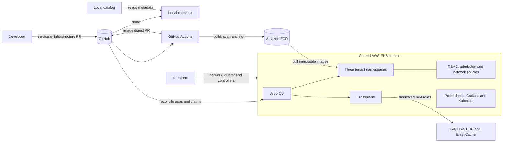

<div align="center">


# Internal Developer Platform

**A personal platform engineering project built around AWS, Kubernetes and GitOps.**

[](https://github.com/amr-elzoghby/Internal-Developer-Platform/actions/workflows/quality.yaml)
[](https://github.com/amr-elzoghby/Internal-Developer-Platform/actions/workflows/security.yaml)
[](https://github.com/amr-elzoghby/Internal-Developer-Platform/actions/workflows/service-ci.yaml)

[Local demo](#local-demo) · [Architecture](#architecture) · [Code guide](#code-guide) · [Validation](#validation) · [AWS deployment guide](docs/aws-deployment.md)

</div>

## Why this project

Deploying a service usually means assembling infrastructure, permissions, manifests, a delivery pipeline and monitoring. This project explores how a reusable platform can provide those building blocks through service templates and small infrastructure requests stored in Git.

The design uses one EKS cluster with three **simulated teams** to demonstrate namespace isolation. It is a personal portfolio project; the team names and `prod` directory describe the example environment, not a company deployment.

**Current status:** the local catalog runs without AWS. CI validates the infrastructure configuration, policies and templates, and builds, smoke-tests and scans the Node.js and Python starter images. The complete platform has **not been deployed end to end on AWS**.

## What I implemented

| Area | Implementation | Skills demonstrated |
|---|---|---|
| Infrastructure as code | Separate Terraform roots for state bootstrap, networking, EKS and controllers; explicit SSM output contracts | AWS architecture, Terraform modules, state boundaries |
| Kubernetes isolation | Namespaces, RBAC, quotas, restricted Pod Security, native admission rules and NetworkPolicies | Access control, workload hardening, multi-tenancy |
| GitOps | Argo CD projects and ApplicationSets scoped to each team; HPA replica counts preserved during sync | Declarative delivery, reconciliation, autoscaling |
| Infrastructure APIs | Crossplane APIs for S3, EC2, PostgreSQL and Redis with constrained inputs and retention defaults | Platform API design, AWS IAM, resource lifecycle |
| CI/CD | GitHub Actions with build/smoke checks, Trivy scans, OIDC publishing, signed image digests and promotion pull requests | Container delivery, supply-chain controls, automation |
| Developer experience | Node.js, Python/FastAPI and PostgreSQL Backstage templates; a local read-only service catalog | Reusable service starters, metadata and ownership |
| Observability | Prometheus alerts, a Grafana dashboard and Kubecost configuration | Monitoring, alert testing, cost visibility |

## Architecture


```mermaid
flowchart LR
    DEV[Developer] -->|service or infrastructure PR| GIT[(GitHub)]
    GIT -->|clone| WORK[Local checkout]
    CATALOG[Local catalog] -. reads metadata .-> WORK
    GIT --> CI[GitHub Actions]
    CI -->|build, scan and sign| ECR[(Amazon ECR)]
    CI -->|image digest PR| GIT
    TF[Terraform] -->|network, cluster and controllers| EKS

    subgraph EKS[Shared AWS EKS cluster]
        ARGO[Argo CD] --> NS[Three tenant namespaces]
        ARGO --> CP[Crossplane]
        NS --- GUARDS[RBAC, admission and network policies]
        OBS[Prometheus, Grafana and Kubecost]
    end

    GIT -->|reconcile apps and claims| ARGO
    ECR -->|pull immutable images| NS
    CP -->|dedicated IAM roles| AWS[S3, EC2, RDS and ElastiCache]
```

Terraform provides the foundation. Argo CD reconciles application manifests and infrastructure requests from Git. Crossplane translates those requests into AWS resources. The local catalog displays repository metadata so the model can be explored without creating cloud resources.

### Application delivery

1. A service template generates source code, a Dockerfile, catalog metadata and Kubernetes manifests under `apps/<team>/<service>`.
2. After the source is merged, GitHub Actions builds, smoke-tests and scans it before a separate OIDC job can publish an immutable image to ECR.
3. The workflow opens a pull request containing the verified image digest. Merging that change allows Argo CD to activate the workload.

New services start with an empty Kustomization until an image is promoted. The included `login-app` is a **quarantined metadata example** with no source or active deployment. CI exercises the actual starter templates; the repository currently has no active source-owned application.

### Infrastructure requests

| Crossplane API | AWS service | Examples of configured defaults |
|---|---|---|
| `ObjectBucket` | S3 | Public access blocked, encryption, versioning, TLS-only access |
| `ServerInstance` | EC2 | Private address, no inbound access, IMDSv2, encrypted storage |
| `PostgresSQLInstance` | RDS PostgreSQL | Isolated data subnets, Multi-AZ, encryption, backups |
| `RedisInstance` | ElastiCache Redis | TLS, authentication, encryption, failover and snapshots |

Requests and their managed resources are namespaced. The PostgreSQL template generates a claim and an ExternalSecret through a pull request. The other APIs have example claims in the repository.

## Local demo

Use Node.js 24 and npm; AWS credentials and Docker are not needed.

```bash
git clone https://github.com/amr-elzoghby/Internal-Developer-Platform.git
cd Internal-Developer-Platform
npm ci --ignore-scripts --prefix platform/developer-portal/local-catalog
npm start --prefix platform/developer-portal/local-catalog
```

Open **http://127.0.0.1:3000**. If you already cloned the repository, start from the two npm commands. Stop the server with `Ctrl+C`.

In the demo, inspect `login-app` and its related PostgreSQL claim, and explore the four infrastructure API contracts. The catalog reads local files; it has no login, provisioning backend or live cluster connection. Its team selector changes the displayed team identity without filtering services or enforcing access. The Backstage templates require a separately installed Backstage application to run the scaffolder.

## Design decisions

- **One cluster, three namespaces:** demonstrates team boundaries with a shared control plane. Cluster-wide controllers and CRDs remain platform-owned.
- **Small Terraform states:** network, EKS and controllers have separate state keys and exchange nonsecret values through SSM contracts.
- **Git as the change path:** generated services and infrastructure requests go through pull requests; the catalog stays read-only.
- **Restricted workload defaults:** tenant RBAC excludes Secret access and RBAC mutation; admission checks image digests, ownership labels and resource limits. Tenant policies deny general internet egress and allow specific DNS, internal and database traffic.
- **Retention for stateful resources:** Crossplane omits the `Delete` management policy and the `gp3` StorageClass retains volumes. Removing a claim or PVC is not a complete cloud cleanup.

## Code guide

| Path | Purpose |
|---|---|
| [`infrastructure/terraform`](infrastructure/terraform) | AWS modules, deployment roots, provider locks and IAM regression tests |
| [`infrastructure/crossplane`](infrastructure/crossplane) | Infrastructure API definitions, Compositions, claims and schema validation |
| [`tenants`](tenants) | Namespace, RBAC, quota and network isolation manifests |
| [`platform/gitops/argocd`](platform/gitops/argocd) | Argo CD installation, projects and ApplicationSets |
| [`platform/operations`](platform/operations) | Saved-plan review, cluster identity checks and bootstrap automation |
| [`platform/security/admission`](platform/security/admission) | Native Kubernetes admission policies and rollout logic |
| [`platform/observability`](platform/observability) | Metrics, dashboard, alerts and cost configuration |
| [`platform/developer-portal/local-catalog`](platform/developer-portal/local-catalog) | Runnable local catalog |
| [`templates/backstage`](templates/backstage) | Node.js, Python and database templates |
| [`apps`](apps) | Quarantined catalog example and destination for generated services |
| [`.github/workflows`](.github/workflows) and [`platform/validation`](platform/validation) | CI pipelines, contract checks, rendering and delivery tests |

## Validation

After installing the catalog dependencies, its tests run locally:

```bash
npm test --prefix platform/developer-portal/local-catalog
make test-destroy-guard
```

The destroy-guard suite uses mock commands. For Terraform checks, install Terraform `>=1.11.0,<2.0` and run `make validate` in a **fresh checkout**. It downloads locked providers and validates all four roots. Use an isolated checkout if the working copy already has remote backend metadata.

The [quality workflow](.github/workflows/quality.yaml) contains the full reproducible setup, including pinned Python dependencies. It covers Terraform and IAM regressions, Kubernetes rendering, Crossplane provider schemas, template serialization, GitOps/HPA behavior, bootstrap guards, alert behavior and container HTTP checks. The [security workflow](.github/workflows/security.yaml) adds repository security analysis. The badges link to current results.

## Next steps

The next milestone is an AWS sandbox deployment: verify tenant isolation, Crossplane reconciliation, ECR promotion and Argo CD sync together. Live monitoring, secret rotation and restore tests also remain to be exercised. External ingress needs a real hostname, certificate and routing configuration.

For cloud prerequisites, bootstrap order, state handling and teardown, see the [AWS deployment guide](docs/aws-deployment.md). Cloud deployment is optional and creates billable resources; the local demo is independent of it.

---

Built and maintained by [Amr Elzoghby](https://github.com/amr-elzoghby).
