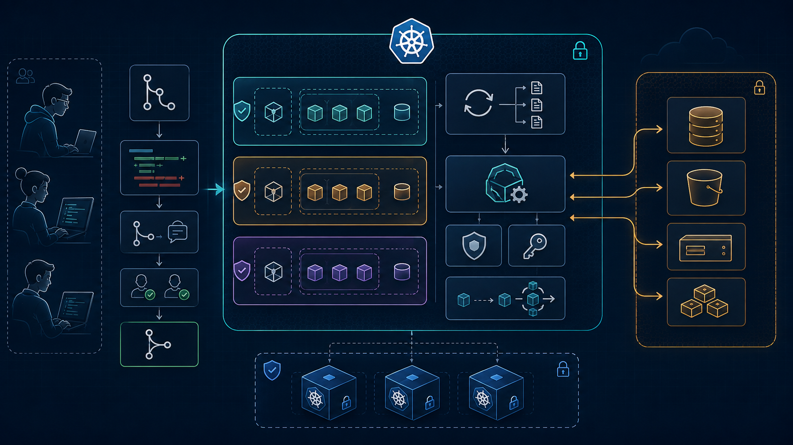
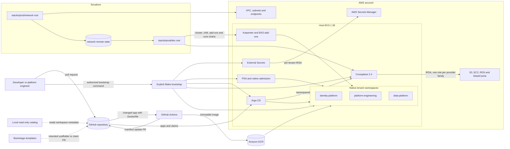

<div align="center">



# Internal Developer Platform

[](https://kubernetes.io/)
[](https://www.crossplane.io/)
[](https://developer.hashicorp.com/terraform)
[](https://aws.amazon.com/eks/)
[](#validation-evidence)

An AWS EKS platform reference implementation built around reviewed Git changes, namespace-scoped tenancy, GitOps delivery, and namespaced Crossplane APIs.

</div>

> [!IMPORTANT]
> This repository has passed local and static validation, but the current revision has not been deployed end to end to a live AWS/EKS environment. “Configured” below means the implementation exists in Git; it does not mean a controller or cloud resource is currently running.

## What this repository contains

- Two Terraform roots: one for the VPC and one for EKS and its AWS integrations.
- Three native EKS tenant namespaces with EKS access entries, Kubernetes RBAC, quotas, limits, Pod Security Admission, and NetworkPolicies.
- Argo CD AppProjects and ApplicationSets scoped to each approved team.
- Four direct, namespaced Crossplane v2 APIs for S3, EC2, RDS PostgreSQL, and ElastiCache Redis.
- GitHub Actions that build changed monorepo services, scan them with Trivy, push immutable ECR tags, and open a manifest-update pull request.
- Backstage template definitions plus a lightweight, local, read-only catalog.

It does **not** currently provide a fully built Backstage application, a verified live cluster, or a configured external Ingress path. Service templates now submit pull requests to this monorepo; their complete build-to-deployment flow is being validated.

## Current component status

| Area | Repository state | Live evidence |
|---|---|---|
| Terraform network | Implemented; `validate` passes | Not applied in this review |
| Terraform EKS | Implemented; `validate` passes with dependency deprecation warnings | Not applied in this review |
| Tenant RBAC and admission | Manifests implemented and parsed | No EKS API-server tests yet |
| Argo CD | Chart and boundaries configured | No sync test yet |
| Crossplane | Core, providers, XRDs, Compositions, and claims configured | No provider reconciliation test yet |
| GitHub Actions | Workflow implemented for `apps/<team>/<service>` | No workflow run verified for this revision |
| Local catalog | Read-only server and UI; local HTTP smoke passed | Local only |
| Backstage | Configuration, catalog entities, and templates only | Docker build is not self-contained |
| Monitoring | Values/dashboard files exist; separate Make target | No live Prometheus/Grafana/Kubecost evidence |
| Kyverno | Legacy policy files retained | Bootstrap intentionally disables it |

## Architecture

The generated image above is a high-level visual. This diagram is the source of truth for the relationships implemented in the repository:


```mermaid
flowchart LR
    DEV[Developer or platform engineer]
    GIT[(GitHub repository)]
    LOCAL[Local read-only catalog]
    TPL[Backstage templates]
    BOOT[Explicit Make bootstrap]
    CI[GitHub Actions]
    ECR[(Amazon ECR)]

    subgraph TF[Terraform]
        NETROOT[stacks/prod/network root]
        EKSROOT[stacks/prod/eks root]
        NETSTATE[(network remote state)]
    end

    subgraph AWS[AWS account]
        VPC[VPC, subnets and endpoints]

        subgraph HOST[Host EKS 1.36]
            ARGO[Argo CD]
            CP[Crossplane 2.4]
            ESO[External Secrets]
            POLICY[PSA and native admission]
            KARP[Karpenter and EKS add-ons]

            subgraph TENANTS[Native tenant namespaces]
                ID[identity-platform]
                PE[platform-engineering]
                DATA[data-platform]
            end

        end

        CLOUD[S3, EC2, RDS and ElastiCache]
        SM[AWS Secrets Manager]
    end

    DEV -->|pull request| GIT
    LOCAL -. reads workspace metadata .-> GIT
    TPL -. intended scaffolder or claim PR .-> GIT
    DEV -->|authorized bootstrap command| BOOT
    GIT -->|changed app with Dockerfile| CI
    CI -->|immutable image| ECR
    CI -->|manifest update PR| GIT
    GIT -->|apps and claims| ARGO
    ARGO --> TENANTS
    ARGO -->|namespaced IDP claims| CP
    CP -->|IRSA, one role per provider family| CLOUD
    ESO -->|per-tenant IRSA| SM

    NETROOT --> VPC
    NETROOT --> NETSTATE
    NETSTATE --> EKSROOT
    EKSROOT -->|cluster, IAM, add-ons and core charts| KARP
    EKSROOT --> CP
    BOOT --> ESO
    BOOT --> POLICY
    BOOT --> ARGO
    BOOT --> CP
    BOOT --> TENANTS
    ECR --> TENANTS
    POLICY --> TENANTS
    KARP --> TENANTS
```

### Terraform dependency flow

```text
infrastructure/terraform/stacks/prod/network
  └─ module.network
     ├─ VPC 10.0.0.0/16
     ├─ two public and two private subnets
     ├─ route tables and Internet Gateway
     ├─ node and endpoint Security Groups
     └─ S3, ECR, STS, EKS, EC2, SSM and Logs endpoints

network outputs
  └─ S3 remote state: prod/network/terraform.tfstate
     └─ read by stacks/prod/eks
        └─ module.eks
           ├─ EKS 1.36 and encrypted Kubernetes Secrets
           ├─ stable managed node group
           ├─ EKS managed add-ons and Metrics Server
           ├─ Karpenter and Crossplane Helm releases
           ├─ EKS access entries and tenant IRSA roles
           └─ GitHub Actions OIDC/ECR permissions
```

The roots deliberately use separate state keys:

- `prod/network/terraform.tfstate`
- `prod/eks/terraform.tfstate`

The backend bucket and DynamoDB lock table are assumed to exist; this repository does not bootstrap them.

## Tenant model

| Team | Native namespace | EKS groups | Argo CD project |
|---|---|---|---|
| Identity Platform | `identity-platform` | `idp:tenant:identity-platform:viewer`<br>`idp:tenant:identity-platform:operator` | `identity-platform` |
| Platform Engineering | `platform-engineering` | `idp:tenant:platform-engineering:viewer`<br>`idp:tenant:platform-engineering:operator` | `platform-engineering` |
| Data Platform | `data-platform` | `idp:tenant:data-platform:viewer`<br>`idp:tenant:data-platform:operator` | `data-platform` |

Native namespaces are the only tenant isolation model implemented by this repository. A viewer can inspect ordinary workload resources and logs inside its own namespace. An operator adds limited pod deletion and scale operations. Neither role is granted Secret access or RBAC mutation.

The access path is `IAM role -> EKS access entry -> Kubernetes group -> one or more namespaced RoleBindings`. Viewer groups bind to `idp-tenant-viewer`; operator groups bind to both `idp-tenant-viewer` and `idp-tenant-operator-actions`. The example variables use AWS IAM Identity Center roles, so a tenant user can authenticate with a matching local AWS CLI profile and verify both the intended access and the isolation boundary:

```bash
aws sso login --profile identity-platform-viewer
aws eks update-kubeconfig \
  --name idp-prod \
  --region us-east-1 \
  --profile identity-platform-viewer \
  --alias idp-prod-identity-platform-viewer

kubectl auth can-i get pods -n identity-platform       # expected: yes
kubectl auth can-i get secrets -n identity-platform    # expected: no
kubectl auth can-i get pods -n data-platform           # expected: no
```

Namespace-only tenancy keeps one control plane, one bootstrap path, and lower operating cost. The trade-off is a shared control-plane blast radius: tenants cannot choose an independent Kubernetes version or API server, and cluster-scoped CRDs or controllers remain platform-owned rather than tenant-owned.

Each namespace receives:

- `ResourceQuota` and `LimitRange`.
- a restricted workload ServiceAccount with token automount disabled by default.
- a per-tenant External Secrets IRSA identity.
- Pod Security labels: baseline enforced; restricted audited and warned.
- native admission rules for tenant-owned ECR SHA-256 image digests, CPU/memory requests and limits, and a team label matching the namespace.
- a default tenant NetworkPolicy that permits same-namespace traffic, DNS, and HTTPS egress.

The current HTTPS egress and database Security Group rules are transitional and broader than the final target; see [Known gaps](#known-gaps).

## GitOps and application delivery

Argo CD watches:

- `apps/identity-platform/*`
- `apps/platform-engineering/*`
- `apps/data-platform/*`
- `infrastructure/crossplane/claims/*`

Team AppProjects can deploy only to their own namespace and only approved namespaced workload kinds. The default project is closed. The infrastructure project accepts only the four `idp.io` claim kinds and External Secrets resources in approved tenant namespaces.

For a service already inside `apps/<team>/<service>` with a `Dockerfile`:

```text
merge app change to main
→ GitHub Actions detects the service
→ assume AWS role with GitHub OIDC
→ build or reuse the commit-SHA image
→ fail on CRITICAL Trivy findings
→ push to an immutable ECR repository
→ open a dedicated manifest-update pull request
→ review and merge
→ Argo CD reconciles the manifest
```

The workflow does not build the current `login-app` example because that directory contains only a deployment manifest. Its old ECR repository name is intentionally retained until the published artifact is verified and copied by digest.

## Crossplane infrastructure APIs

Crossplane uses direct namespaced v2 XRDs. A claim and its generated managed resources stay in the requesting namespace.

| API | AWS resources generated | Current safety defaults |
|---|---|---|
| `ObjectBucket` | S3 Bucket | generated platform-prefixed name and management tags; explicit encryption/versioning/public-access resources are not implemented yet |
| `ServerInstance` | EC2 Instance, Security Group, rule | private subnet, approved sizes, and AMI ID format validation; IMDSv2 and root-volume encryption are not declared yet |
| `PostgresSQLInstance` | RDS Instance, subnet group, Security Group, rule | private, encrypted gp3, 7-day backups, deletion protection |
| `RedisInstance` | ElastiCache Replication Group, subnet group, Security Group, rule | private subnet placement and approved sizes; further hardening required |

The package layer is intentionally limited:

- Crossplane Core `2.4.0`
- Upbound AWS providers `2.7.1` for S3, EC2, RDS, and ElastiCache
- Crossplane Function Python `0.5.0`
- one `ClusterProviderConfig`
- four dedicated IRSA roles
- one ManagedResourceActivationPolicy activating exactly eight managed resource kinds

Managed resources omit the `Delete` management policy. Removing a Git claim therefore does not automatically delete the cloud resource. This protects stateful resources from accidental Git pruning, but requires an explicit orphan cleanup and deletion runbook.

The approved database template writes a PostgreSQL claim and ExternalSecret into the monorepo claims path through a pull request. Redis, S3, and EC2 have APIs but no reviewed Backstage request template yet.

## Developer experience

### Local catalog

`make portal-up` launches `platform/developer-portal/local-catalog/server.js` on `127.0.0.1:3000`.

It can:

- scan local `catalog-info.yaml` files;
- show detected infrastructure YAML files;
- display the four implemented API contracts;
- present a local team view selector.

It cannot authenticate users, enforce RBAC, write files, run Git commands, provision infrastructure, or report live Kubernetes/Argo/Trivy/SonarQube metrics. The team selector is presentation-only.

### Backstage assets

`platform/developer-portal/backstage-config` contains catalog/configuration material, not a self-contained Backstage application. Its Dockerfile expects a Backstage monorepo with `package.json`, `yarn.lock`, `packages`, and `plugins`, which are not present here.

The Node.js and Python templates open reviewed pull requests into `apps/<team>/<service>` in this repository. Both emit root deployment manifests and a Kustomize entry point that Argo CD can discover. They do not create independent repositories or run a catalog registration step before the pull request merges.

Infrastructure requests declare an owner and an ownership review date, retain those values in AWS tags, and use enforced Composition references with Manual revision updates. Follow the [retained-resource lifecycle](docs/operations/crossplane-lifecycle.md) and [revision promotion](docs/operations/crossplane-revisions.md) procedures before decommissioning data or moving existing requests to a new revision.

## Security controls represented in code

- EKS Secrets encryption with a rotating customer-managed KMS key.
- EKS control-plane logging for API, audit, authenticator, controller manager, and scheduler.
- IMDSv2 required in the stable node launch template.
- IRSA trust restricted to exact provider or tenant ServiceAccounts.
- separate Crossplane IAM roles for each AWS service family.
- an explicit deny preventing the S3 provider from accessing the Terraform state bucket.
- ownership-tag guardrails around managed RDS, ElastiCache, and EC2 resources.
- namespace-scoped tenant RBAC with no Secret or RBAC write permissions.
- Pod Security Admission and fail-closed native ValidatingAdmissionPolicies.
- Argo CD destination and resource allowlists.
- GitHub Actions OIDC, empty workflow-level permissions, immutable ECR tags, and a CRITICAL Trivy gate.
- confirmation guard before destructive Make targets.

These are implementation controls, not audit evidence. IAM behavior, admission behavior, and isolation still need live positive and negative tests.

## Version pins

| Component | Version or constraint |
|---|---|
| Kubernetes / EKS | `1.36` |
| Terraform | network `>=1.5.0`; EKS `>=1.5.7` |
| AWS provider | network `~>5.0`; EKS `>=6.52,<7.0` |
| Karpenter | `1.14.1` |
| Crossplane | `2.4.0` |
| Upbound AWS providers | `2.7.1` |
| Function Python | `0.5.0` |
| Argo CD Helm chart | `10.1.4` |
| Metrics Server chart | `3.13.1` |
| VPC CNI | `v1.22.4-eksbuild.3` |
| CoreDNS | `v1.14.3-eksbuild.14` |
| kube-proxy | `v1.36.0-eksbuild.17` |
| EBS CSI | `v1.65.0-eksbuild.1` |
| EKS Pod Identity Agent | `v1.3.10-eksbuild.3` |

Prometheus (`kube-prometheus-stack` chart `89.2.2`), Kubecost (`kubecost` chart `3.2.4`), and External Secrets (`2.10.0`) are pinned. Monitoring installs use atomic rollback, readiness waits, and explicit timeouts. Kubecost 3 uses its FinOps agent; the retired cost-analyzer chart and its external Prometheus URL are no longer configured. Its cluster ID is passed from `CLUSTER_NAME`, and persistent storage uses `gp3`.

Admission updates compile versioned candidate policies while the previous Deny bindings remain enforced. Candidates receive Deny bindings before the old revision is retired. Compilation failures leave the previous rules active. The archived Kyverno installer exits with failure even when invoked directly.

`make up` executes infrastructure, cluster configuration, and monitoring in order even under `make -j`. `make status` propagates errors; `make health-check` also checks API readiness, nodes, the Karpenter NodeClass, and Argo Deployments. `make validate` checks Terraform formatting before initialization and validation.

The `gp3` StorageClass retains EBS volumes after PVC deletion; retained volumes still need inventory, backups, and an explicit decommission decision. Stakater Reloader chart `2.2.16` watches the tenant namespaces through scoped RBAC and restarts annotated workloads after referenced secrets change. See the [credential rotation and rollback procedure](docs/operations/secret-rotation.md); a restart alone does not guarantee uninterrupted database access.

## Repository map

```text
.
├── .github/
│   ├── CODEOWNERS
│   └── workflows/service-ci.yaml
├── apps/
│   └── identity-platform/login-app/deployment.yaml
├── templates/backstage/
│   ├── infra-database/
│   ├── nodejs-service/
│   └── python-fastapi/
├── infrastructure/
│   ├── terraform/
│   │   ├── stacks/prod/{network,eks}/
│   │   └── modules/{network,eks}/
│   └── crossplane/
│       ├── packages/
│       ├── provider-configs/
│       ├── apis/{definitions,compositions}/
│       ├── claims/identity-platform/
│       └── scripts/
├── platform/
│   ├── bootstrap/{karpenter,storage}/
│   ├── developer-portal/
│   │   ├── backstage-config/
│   │   └── local-catalog/
│   ├── gitops/argocd/
│   ├── operations/
│   │   ├── tests/
│   │   └── verify-destroy-target.sh
│   ├── observability/{prometheus,grafana,kubecost}/
│   └── security/{admission,kyverno-disabled}/
├── tenants/
│   ├── base/
│   ├── namespaces/
│   ├── rbac/
│   └── templates/
├── Makefile
└── README.md
```

## Safe local validation

Prerequisites:

- Terraform `>=1.5.7`
- AWS CLI, Helm, kubectl, Make
- Python 3 and `envsubst`
- Node.js for the local catalog

Commands that do not intentionally apply infrastructure:

```bash
# May download providers, but uses no remote backend.
make validate

# Inspect the command graph without executing it.
make -n cluster-up
make -n tenant-up

# Uses mock binaries only; does not contact or change AWS/Kubernetes.
make test-destroy-guard

# Run the read-only local catalog. PROJECTS_DIR must contain service
# repositories with catalog-info.yaml at their top level.
PROJECTS_DIR=/path/to/service-workspace make portal-up
```

Before any AWS plan:

1. Confirm the intended AWS account and `us-east-1` region.
2. Create or deliberately replace the backend bucket and lock-table configuration.
3. Copy `infrastructure/terraform/stacks/prod/eks/terraform.tfvars.example` to an ignored `terraform.tfvars`.
4. Replace every `REPLACE_ME` IAM role ARN with a real role in the cluster account.
5. Review the network plan first, then the EKS plan.

```bash
terraform -chdir=infrastructure/terraform/stacks/prod/network init
terraform -chdir=infrastructure/terraform/stacks/prod/network plan

terraform -chdir=infrastructure/terraform/stacks/prod/eks init
terraform -chdir=infrastructure/terraform/stacks/prod/eks plan
```

Do not use `make up` as a first validation command: `infra-up` currently invokes `terraform apply -auto-approve`.

## Validation evidence

The current revision was checked with:

- Terraform formatting and validation for both roots.
- YAML and JSON parsing across repository manifests.
- rendered Golden Path checks for YAML, JavaScript, and Python.
- JavaScript syntax checks for the local catalog.
- local HTTP smoke tests for catalog, health, and claim-spec endpoints.
- negative local tests confirming removed login/write endpoints return `404` and path traversal does not expose files.
- Make dry-runs for the cluster and tenant bootstrap paths.
- reference searches for retired team names and portal capabilities.

The EKS Terraform validation reports deprecation warnings from the downloaded `terraform-aws-modules/iam` dependency. They do not fail validation, but the module should be upgraded in a reviewed change.

## Known gaps

The highest-priority gaps are:

1. No end-to-end deployment or live isolation evidence.
2. Stable EKS nodes currently target public subnets.
3. The EKS public endpoint has no CIDR allowlist in this module.
4. NGINX Ingress resources exist without an installed NGINX controller.
5. The monorepo template layout is implemented; build, digest promotion, and end-to-end deployment still require validation.
6. Crossplane provider schemas, EC2 namespaced rendering, and connection-secret keys need live canaries.
7. S3 and EC2 Compositions do not yet declare the required production data and instance hardening controls.
8. tenant HTTPS egress and RDS/Redis VPC-wide ingress are broader than the target design.
9. Redis lacks production encryption, authentication, high availability, and backup settings.
10. Monitoring charts render locally, but cost collection, alert delivery, and storage recovery still require a sandbox test.
11. Backstage is configuration-only, not a runnable production portal.

## Destructive operations

`make down`, `make infra-down`, and `make cluster-down` require the exact `CONFIRM_DESTROY=851236938302/us-east-1/idp-prod` value. The production account, region, and cluster identity are review-pinned and cannot be overridden from the Make command line.

Before Terraform destroy, the guard verifies the active AWS account, passes the reviewed region and cluster inputs, forces the default workspace, and the AWS providers and S3 backends independently reject every other account. These checks prevent accidental account/input drift; they do not prove the contents of an already initialized Terraform state, so reviewing the destroy plan remains mandatory. Before any Kubernetes deletion, the guard also verifies the live EKS ARN and `ACTIVE` status. It snapshots the selected kube-context into a private temporary file, matches that snapshot's endpoint and certificate authority to EKS, checks the required delete permissions, and uses only that verified snapshot for every delete. Any missing credential, API failure, Kubernetes identity mismatch, insecure TLS context, or insufficient permission stops `cluster-down` before the first deletion. `cluster-down` does not explicitly delete tenant namespaces, but the full `make down` path destroys the EKS infrastructure and therefore everything hosted on that cluster.

Even with that guard, always inspect the active AWS account, kube-context, Terraform plan, backups, and rollback path before running a destructive command.

---

Maintained by [Amr Elzoghby](https://github.com/amr-elzoghby).
